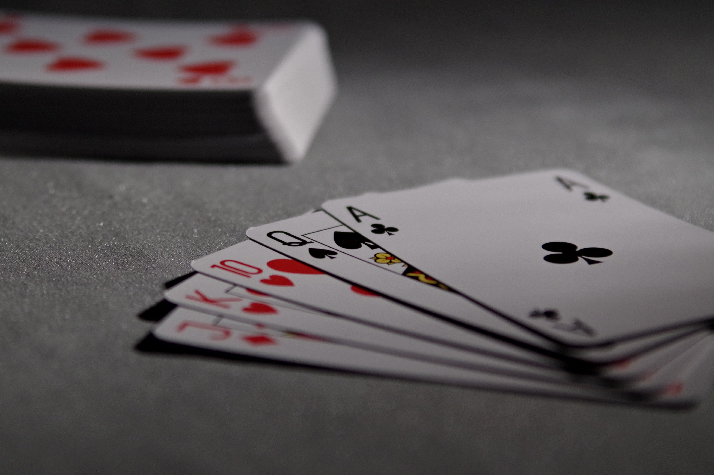

# Cards Clicky Game

### This is a card memory game built from React.

### Technology Stack: React, HTML, CSS, Bootstrap, JavaScript, jQuery

---

### How It Works

- Go to the app's home page at .
- The application will render different playing cards to the screen.
- The user should then click on individual cards to gain points. The user's score will be incremented when clicking an image for the first time.
- The user's score should be reset to 0 if they click the same image more than once.
- Every time an image is clicked, the images rendered to the page will shuffle themselves in a random order.
- Once the user's score is reset after an incorrect guess, the game will restart.

---
